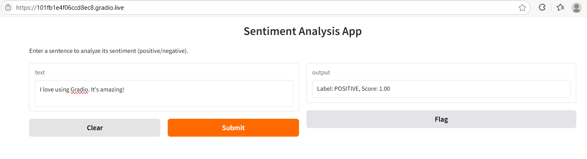

# 🧠 Sentiment Analysis with Gradio

This project is a simple web app that lets users type in text and returns the sentiment (Positive or Negative) using a pre-trained Hugging Face model.

---

## 📦 Dependencies

Install the required libraries:

```bash
pip install -r requirements.txt
```

---

## 🚀 Running the App

Run the following command:

```bash
python app.py
```

If `share=True` is included in the script, Gradio will generate a public `.gradio.live` link like:

```
Running on public URL: https://101fb1e4f06ccd8ec8.gradio.live
```

---

## 💡 How It Works

The app uses the `transformers` pipeline from Hugging Face:

- Model: `distilbert-base-uncased-finetuned-sst-2-english`
- Input: Text sentence
- Output: Sentiment (POSITIVE/NEGATIVE) with confidence score

---

## ✨ Example

Input:
```
I love using Gradio. It's amazing!
```

Output:
```
Label: POSITIVE, Score: 0.999
```

---

## 📁 File Structure

```
sentiment-gradio-app/
├── app.py               # Main Gradio application
├── requirements.txt     # List of dependencies
└── README.md            # Project overview and instructions
```

---

## 📬 Credits

- [Gradio](https://gradio.app)
- [Hugging Face Transformers](https://huggingface.co/transformers/)

---

## 🌐 Deployment Screenshot

Below is an example of the app deployed on a Gradio public link:



This shows the interface users see when accessing your `.gradio.live` app.
